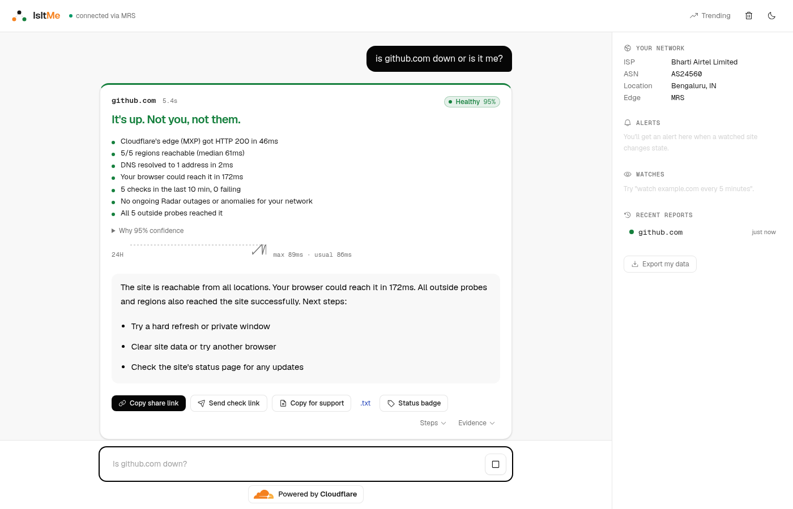

# IsItMe — is it down, or is it me?

[](LICENSE)
[](https://github.com/MrKuros/isitme/actions/workflows/ci.yml)
[](https://developers.cloudflare.com/agents/)

**Ask whether a site is down, and get told whether it's the site, one region, its
provider, the wider internet — or your own connection.**



📖 **Full documentation: <https://mrkuros.github.io/isitme>** — quick start,
every chat command, the twelve verdicts, alerts, sharing, the CLI, the HTTP API,
MCP, self-hosting and troubleshooting. The same pages run locally with
`npm run docs:dev`.

**Live demo:** <https://cf-ai-isitme.patelkashishpatel032.workers.dev> — ask it about any site. Or run it locally
(below) or [deploy your own](#deploy-your-own).

## Why

"Is it down?" sites answer half the question — *is it up from our server?*
Nobody answers the other half: *is it me?* That half is your device, your ISP,
your resolver and your country, measured and compared against the target's real
health. IsItMe answers both.

## Three vantage points

| Vantage | How | What it proves |
|---|---|---|
| **Your device** | A browser probe: `no-cors` fetch timing, a `favicon.ico` fallback, Cloudflare and Google DoH from the browser, a control request, and environment hints (VPN, WARP, Private Relay, captive portal, IPv6) | Whether *your* network and resolver can reach it |
| **Cloudflare's edge** | Both resolvers over DoH, an HTTP probe from the Worker's colo, and five more from Durable Objects placed in `wnam`, `enam`, `weur`, `apac` and `oc` — each reporting the colo it really ran in | Whether the site is up, and where; plus bot protection, TLS failures and "200 but broken" pages |
| **The internet** | Cloudflare Radar outages, traffic anomalies and BGP events, the site's own status page, a CDN/host fingerprint with a cross-host failure count, and [Globalping](https://globalping.io) probes from outside Cloudflare | Whether your ISP, the site's provider or its routing has a known incident |

## Rules decide, the LLM explains

The verdict comes from a pure, deterministic rule engine (`src/lib/classify.ts`,
first match wins) over the measurements. It picks one of twelve verdicts —
`HEALTHY`, `SLOW`, `DOWN_GLOBAL`, `DOWN_REGIONAL`, `DNS_FAILURE`,
`LIKELY_YOUR_NETWORK`, `ISP_OUTAGE`, `UPSTREAM_OUTAGE`, `BLOCKED`, `TLS_ERROR`,
`PARTIAL` or `INCONCLUSIVE` — with a subtype, a confidence score, the signals
behind it and a per-factor breakdown.

Llama 3.3 on Workers AI (`src/lib/explain.ts`) then writes the explanation. It
is given the verdict and the evidence and may only restate them: a post-filter
drops any sentence naming a provider that isn't in the evidence, and if Workers
AI is unavailable, per-verdict templates take over. **The model never decides,
and no evidence source is allowed to change that** — Globalping, for instance,
contributes one descriptive line to the signals and nothing else, which
`test/globalping.test.ts` pins.

Missing evidence is never counted as failure. It lowers confidence, and when too
few independent vantages answer, "not enough evidence" (`INCONCLUSIVE`) is the
answer you get.

## Quick start

```bash
git clone https://github.com/MrKuros/isitme && cd isitme
npm install
npx wrangler login     # Workers AI runs remotely even in dev
npm run dev            # http://localhost:5173
```

No Cloudflare account? `npm run dev:local` runs everything except the LLM.

**Chat** — open <http://localhost:5173> and type:

```
is github.com down?
watch mysite.com every 5 minutes and post to https://hooks.slack.com/services/…
what did I check today?
```

**HTTP API** — open to any client, CORS and all:

```bash
curl 'http://localhost:5173/api/v1/check?url=example.com'
curl 'http://localhost:5173/api/v1/check?url=example.com&wait=0'   # 202 + pollPath
```

**CLI** — `bin/isitme.mjs`, zero dependencies, exits 0 when the site is fine and
1 when it isn't, so it works as a CI gate:

```bash
node bin/isitme.mjs example.com --api http://localhost:5173
```

It isn't on npm (the `isitme` package there is someone else's), so run the file
from a checkout. `--api` (or `$ISITME_API`) points it at whichever deployment you
use; the built-in default only answers once the app is deployed.

There is also an MCP server at `/mcp` (`check_site`, `start_check`, `get_check`,
`get_report`), share reports at `/r/:host/:id`, a "check from your side" link for
support teams at `/c/:host`, per-host pages at `/h/:host`, a `/trending` list and
status badges at `/badge/:host.svg`. The
[documentation site](https://mrkuros.github.io/isitme) covers each one.

## Deploy your own

[](https://deploy.workers.cloudflare.com/?url=https://github.com/MrKuros/isitme)

The button needs the repo to be public under that name, so until the rename lands,
deploy from a checkout:

```bash
npx wrangler secret put RADAR_TOKEN   # optional; without it the Radar step is skipped
npm run deploy
```

This creates the Worker, six Durable Object classes, the `diagnose-workflow`
Workflow, the rate limiter, the Analytics Engine dataset and the email binding.
Multi-region probing only becomes real after a deploy — in local dev every
`locationHint` lands in your own colo, and the verdict's confidence is capped
accordingly.

## The Cloudflare assignment

This started as the optional assignment for a Cloudflare Software Engineer
application, which asks for an AI application with four components:

| Requirement | Where it lives |
|---|---|
| **LLM** | Llama 3.3 70B on Workers AI writes every explanation (`src/lib/explain.ts`). Chat tool-routing uses GLM-4.7-Flash, because Llama 3.3's streamed tool-call arguments arrived corrupted in live testing |
| **Workflow / coordination** | `DiagnoseWorkflow`, a Cloudflare Workflow of retried, timed, partly parallel steps with live progress; six Durable Object classes for per-host coalescing, regional placement, provider stats and trends; Agents SDK scheduling for watches and confirm runs |
| **User input via chat** | A React SPA served from Workers static assets, over the Agents SDK WebSocket (`useAgent` + `useAgentChat`) |
| **Memory / state** | `UserAgent` SQLite (reports, runs) plus synced state (watches, alerts, history), persisted chat history, and `TargetDO` SQLite (crowd checks, public reports, latency samples). The system prompt carries your network, your watches and your recent verdicts |

The prompt history the assignment asks for ships with the submission copy at
[MrKuros/cf_ai_isitme](https://github.com/MrKuros/cf_ai_isitme).

## Prior art

[Globalping](https://globalping.io) by [jsDelivr](https://www.jsdelivr.com/) is
the closest thing that already existed, and the best of the bunch: a free,
community-run probe network with an API and an MCP server. It gives you
measurements. IsItMe is the layer on top — a verdict, the "is it me?" half from
your own browser, and memory — and it calls Globalping for corroboration from
outside Cloudflare's network. Downdetector, uptime monitors and status-page
aggregators are the other half of the landscape;
[docs/COMPETITOR_SPEC.md](docs/COMPETITOR_SPEC.md) has the research, the bugs
they share and the rules written to avoid them.

## Roadmap

Open source under the MIT licence, and staying that way. A drop-in widget for
support teams ("ask your customer to run a check") is a plausible next direction
— the `/c/:host` link already does the hard part — but it isn't built.

Contributions welcome: see [CONTRIBUTING.md](CONTRIBUTING.md).

## Licence

[MIT](LICENSE) © 2026 Kashish Patel ([@MrKuros](https://github.com/MrKuros))
