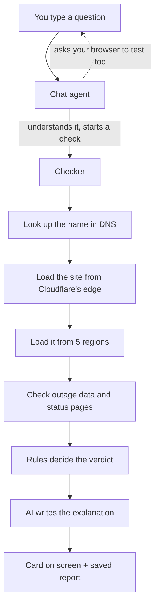

# How it works

> [!TIP] In one line
> You ask "is github.com down, or is it just me?" — the app tests the site from your browser, from five places around the world, and against outage data, then tells you in plain words whose problem it is.

## The idea

Every other tool answers half the question. They check the site from one place and say "up" or "down". If they say "up" and it still fails for you, you learn nothing.

IsItMe answers the other half: **is the problem you?** Your Wi-Fi, your ISP, your DNS, your VPN, or your browser.

## Three points of view

Each check gathers evidence from three places. Disagreement between them is the answer.

| Vantage                  | What it does                                                                                        | What it proves                     |
| ------------------------ | --------------------------------------------------------------------------------------------------- | ---------------------------------- |
| **Your browser**         | tries to load the site from your own machine                                                        | whether _you_ can reach it         |
| **Cloudflare's network** | loads the site from 5 regions (US west, US east, Europe, Asia, Oceania)                             | whether the world can reach it     |
| **Outage data**          | Cloudflare Radar: known outages and routing problems for your ISP, your country and the site's host | whether something bigger is broken |

> [!NOTE] How they combine
>
> - Browser fails + everyone else fine → **it's you**
> - Browser fine + Asia fails → **regional outage**
> - Everyone fails → **the site is down**
> - Everyone fails + your ISP has a known outage → **your ISP**

## What happens when you ask



The whole thing takes about 5–15 seconds, and each step appears on screen as it finishes, so nothing feels stuck.

## The pieces

> [!NOTE] Everything runs on Cloudflare
> No servers to manage. Code runs in whichever Cloudflare data centre is nearest.

- **Chat agent** — one per visitor. Holds your conversation, your saved checks, and the sites you watch. Remembers you between visits.
- **Checker** — the step-by-step process above. It's durable: if one step fails it retries that step alone, and a long check survives interruptions.
- **Site keeper** — one per website checked. Two jobs: if a thousand people check the same site during an outage, it runs the test **once** and shares the answer; and it keeps that site's history and public reports.
- **Regional testers** — five small workers, one per region, each loading the site from where it lives and reporting back.
- **Provider tracker** — notices when many sites sharing a host (Cloudflare, AWS, Fastly) fail at once, which means the host is the problem, not the sites.
- **Trend tracker** — what's breaking right now, across everyone using IsItMe.

## Who decides the answer

> [!IMPORTANT] Fixed rules decide. The AI only explains.
> The verdict comes from plain rules over the evidence — never from the AI. The AI receives the finished verdict and writes the friendly paragraph. It's told never to contradict it, and a filter strips anything it made up.

Why: an AI asked to diagnose will invent a confident cause. Rules can be read, tested and trusted. There are 528 automated tests covering them.

The possible answers: healthy, slow, down everywhere, down in some regions, DNS broken, blocked by bot protection, certificate problem, loads but broken, your network, your ISP, the site's host, or **not enough evidence** — because saying "I don't know" beats guessing.

Two AI models are used: a small fast one to understand your chat message, and Llama 3.3 to write the explanation.

## Memory

- Your past checks, so it can say "slower than usual for this site".
- Sites you **watch**: it re-checks them on a schedule and alerts you in the app, by webhook (Slack, Discord) or by email.
- Alerts are deliberately cautious: a change must be confirmed by a second check before you're told. Competing tools are notorious for flooding people with false alarms.

## Ways in

| Where                                 | What it's for                                                                  |
| ------------------------------------- | ------------------------------------------------------------------------------ |
| The chat page                         | the main way: ask, watch, get alerts                                           |
| A share link                          | send someone the result you just got                                           |
| A "check from your side" link         | send it to a customer; **their** network runs the test and you see the outcome |
| Trending page                         | what's broken right now                                                        |
| A web address other programs can call | put IsItMe in your own scripts                                                 |
| A badge image                         | show a site's status on a README or page                                       |
| An AI connection                      | other assistants (Claude, Cursor) can run checks themselves                    |

## Safety

- **It won't probe private addresses.** Someone could otherwise use it to peek inside internal networks, so home, internal and cloud-metadata addresses are refused, including after redirects.
- **Limits per visitor**, so it can't be used to hammer a site.
- **Page contents are never shown to the AI** — not even the page title — so a hostile page cannot slip it instructions. The only text written by someone else that reaches it is a provider's status-page summary, cut to 80 characters, and a filter drops any company name the evidence does not contain.

## Honest limits

- Multiple regions only work once it's published. On a laptop, all five "regions" are the same machine.
- The browser test proves the site answered and how fast; it can't see the exact response code. The screen says so.
- Outage data needs a free access key; without it that row reads "no data".
- Ping and traceroute don't exist here — Cloudflare's platform can't send them. Everything is done with ordinary web requests.

## Where things live

```
src/lib/classify.ts     the rules that decide the verdict   ← the heart
src/lib/explain.ts      the AI explanation + safety filter
src/lib/guard.ts        refuses unsafe addresses
src/lib/probes.ts       DNS lookups and page loads
src/agents/             chat agent, site keeper, regional testers, trackers
src/workflow/           the step-by-step checker
src/client/             the web pages you see
src/server.ts           routes every incoming request
test/                   528 tests, mostly on the rules
docs/                   deeper reference: contracts, competitor research, API
```

## Running it

```bash
npm install
npx wrangler login      # the AI runs on Cloudflare, even in local testing
npm run dev             # open the address it prints
npm test                # the rules' tests
```
